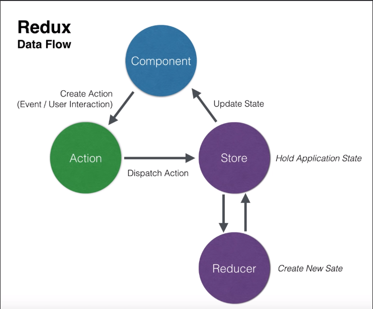

Практика на REDUX

Component взаимодействует с пользователем (Action).

Вместо того чтобы менять напрямую состояние мы отправляем некоторое взаимодействие в Action.

Мы берем action (он не взаимодействует ни с чем, это просто объект) и взаимодействуем со Store (оно держит состояние всего приложения).

Для того чтобы нам что-нибудь изменить, нужно изменить само состояние приложения, а именно Store. В этом заключается суть REDUX. Но напрямую мы его не меняем.

Для этого у нас есть Reducer (это функция которая меняет объект).

1. Верстка и настроенный webpack

2. Прописали переменные и обработчики события к ним.

3. Создали store для того чтобы мы могли обращаться к нему при взаимодействии.

4. Создали rootReducer для того чтобы изменять данные которые мы получаем со state.

// 

Практикуюсь с redux которую установил с помощью npm i redux .

1. Создал файл types так как мы в файле rootReducer передаем в условие фиксированую строку и если мы передадим в условие что-нибудь другое, то приложение не будет работать. Поэтому мы создали константы.

2. Создал файл actions. Теперь в index файле мы можем диспачить не осознанные объекты а уже функции.

3. Установил redux-thunk для работы с асинхронными событиями.

4. Установил redux-logger для того чтобы отслеживать action и состояния(прежнее и измененое)

5. Реализовали изменения темы.